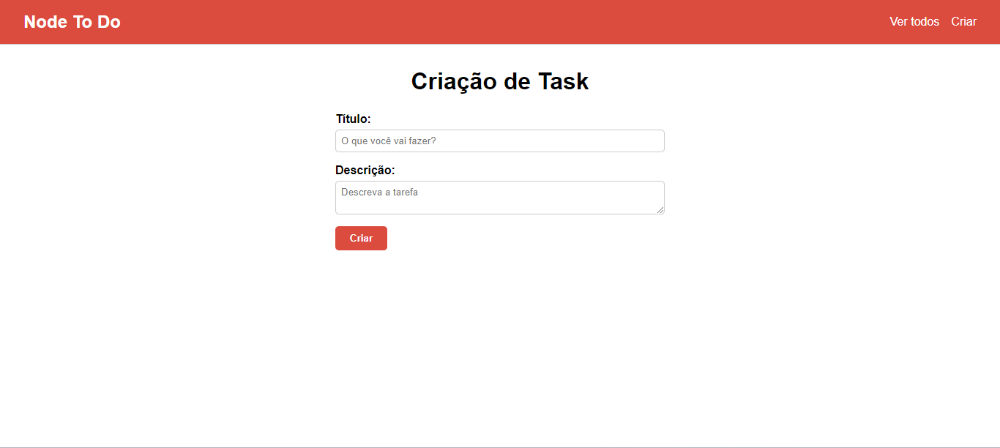
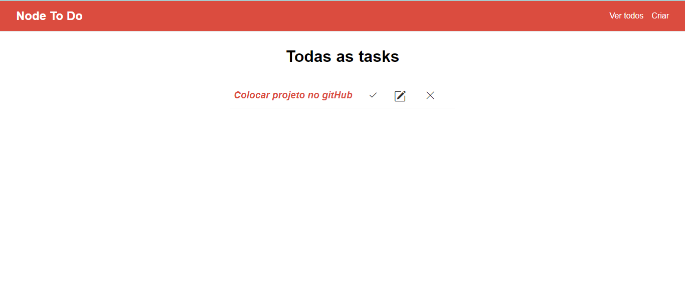

# 🚀 Tasklist com Nodejs e MySQL

O projeto de Task To-Do List é uma aplicação web que permite aos usuários criar, gerenciar e acompanhar suas tarefas diárias. Ele utiliza tecnologias como Node.js, Sequelize, Express, Handlebars e MySQL para fornecer uma plataforma flexível e robusta para o gerenciamento de tarefas. O MySQL foi utilizado para gerenciamento, permitindo o armazenamento seguro e eficiente de informações relacionadas a usuários, tarefas e outros dados essenciais do aplicativo.

Este projeto resolve o problema de gerenciar tarefas diárias de maneira eficaz. Para fins de organização e produtividade, ter uma ferramenta que permita criar, acompanhar e atualizar tarefas é essencial.

## Tecnologias Utilizadas

### Front-End
- **Handlebars**: Utilizado como mecanismo de modelo para renderização dinâmica das páginas HTML.
- CSS

### Back-End
- **Nodejs**
- **Express.js**
- **Sequelize**
- **MySQL**

  

